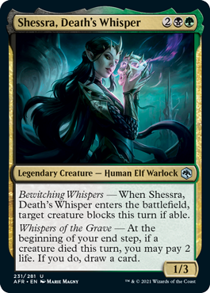
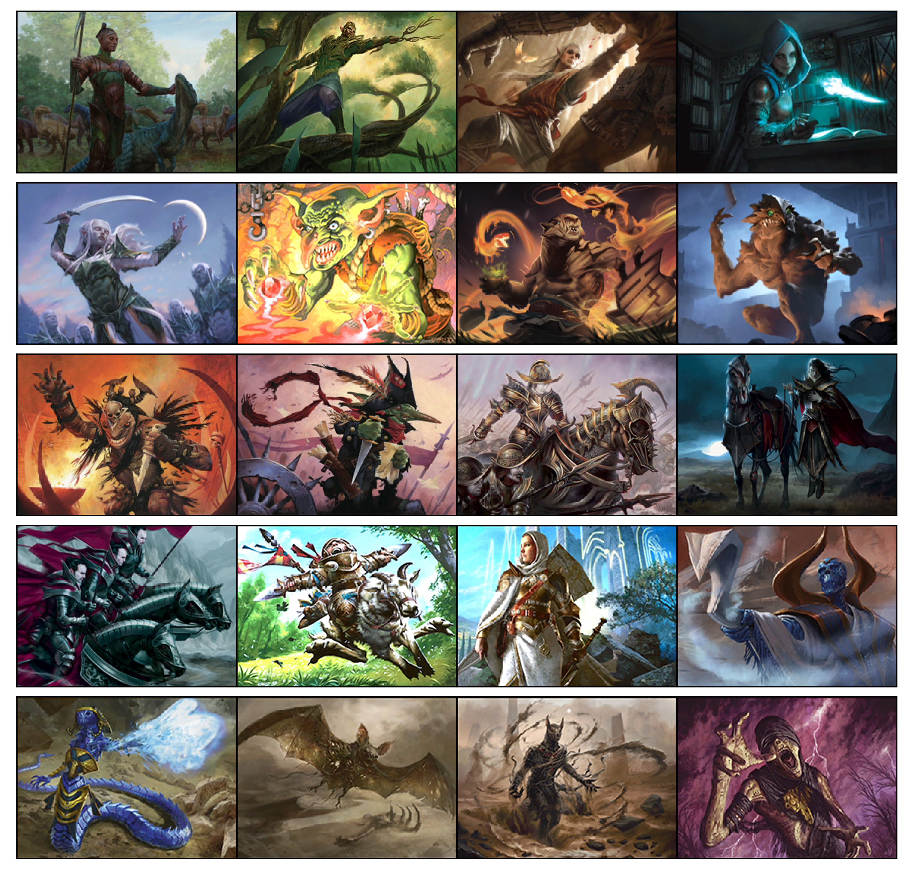
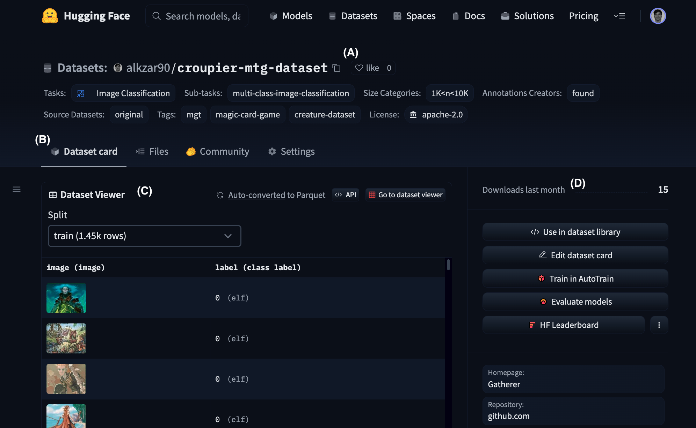
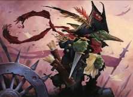
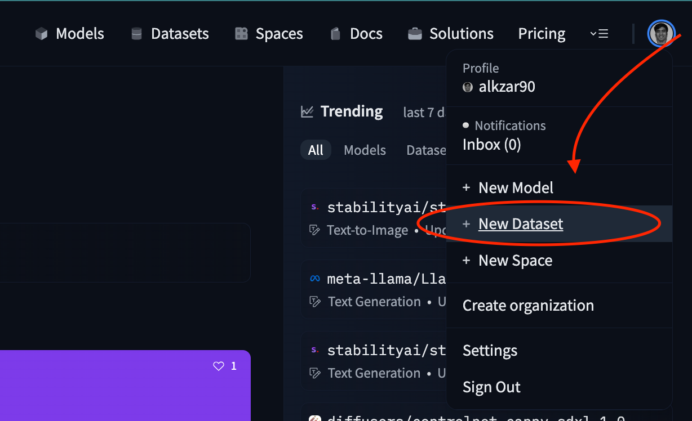
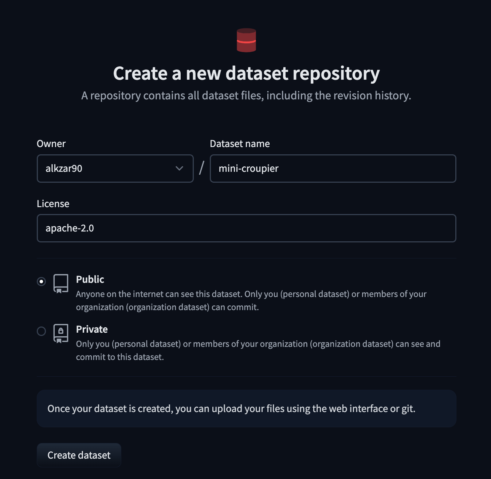
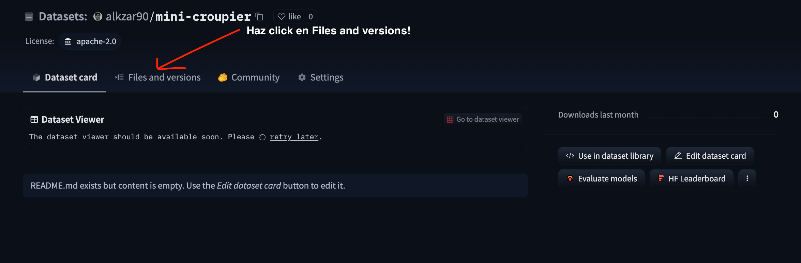
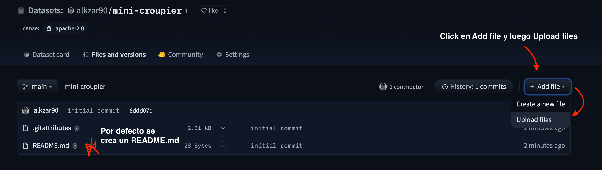
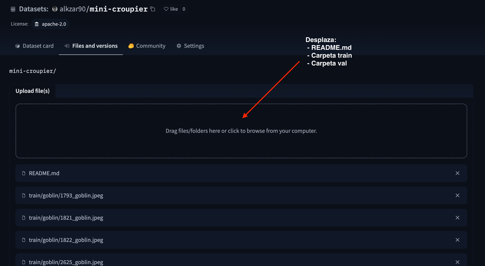
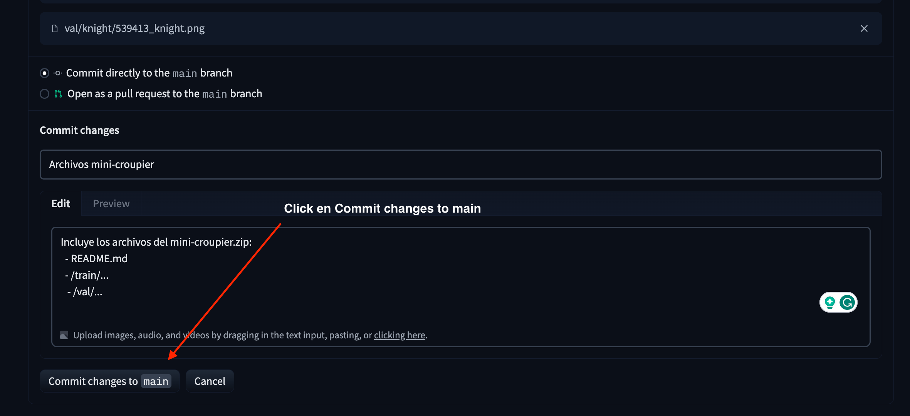

# Tutorial Datasets con Hugging Face

Por Cristóbal Alcázar,

_Tiempo aproximado: 45 mínutos._

En este tutorial vamos a crear nuestro propio conjunto de datos utilizando
la plataforma Hugging Face 🤗. Si sigues todas las instrucciones, desbloquearas la hábilidad de crear repositorios para tus propios conjuntos de datos y cargarlos con la librería [`datasets`](https://huggingface.co/docs/datasets/index) en python usando una simple línea de código.

¿Qué es Hugging Face (aka HF)? Es una start-up de Inteligencia Artificial fundada el año 2016 que dispone de una plataforma (o hub) para compartir modelos de machine learning, datasets, y aplicaciones. Además, desarrolla y mantiene distintas herramientas de código abierto para interactuar con la plataforma, y facilitar el entrenamiento, _fine-tuning_ de modelos, y compartir prototipos a través de _end-points_ de inferencia o demos (e.g. Gradio o Streamlit). Originalmente conocida por la popular librería [`transformer`](https://huggingface.co/docs/transformers/index) para modelos de Procesamiento de Lenguaje Natural, o NLP por su sigla en inglés, la cual se ha expandido rápidamente para cubrir otros campos como Visión por Computadora, Audio, entre otros. Esta librería es popular entre investigadores y desarrolladores por ser una de las primeras
en abstraer y tomar ventaja (de manera seria) de los modelos pre-entrenados. Finalmente, tanto la librería como la plataforma se hicieron muy conocidas por el libro [_Natural Language Processing with Transformers. Building Language Applicationos with Hugging Face_](https://www.oreilly.com/library/view/natural-language-processing/9781098136789/), donde uno de los co-autores es tambien uno de sus co-fundadores.


⚠️  Antes de comenzar el tutorial asegurate de  contar con una cuenta personal en [Hugging Face](https://huggingface.co/), puedes crearte una cuenta (sin costo) siguiendo las instrucciones desde el sitio web.

## Motivación

Comencemos con un conjunto de datos ya existente, veamos de qué se trata todo esto,  y luego exploremos cómo descargar y cargarlos en un Google Colab.

_Introducing (redoble de 🥁)...the [`croupier-mtg-dataset`](https://huggingface.co/datasets/alkzar90/croupier-mtg-dataset) 🎆!_ Cada observación es una imagen de una mítica criatura del popular juego de cartas coleccionables [_Magic the Gathering_](https://es.wikipedia.org/wiki/Magic:_El_encuentro). Si no tienes idea de lo que estoy hablando, no importa, solo basta saber que es un juego de cartas tipo Pokémon, y que así luce
una carta de criatura: 

<p align="center">

</p>

Después de una arbitraria curatoría para seleccionar un grupo de cartas de criaturas y
procesar las imágenes de las cartas para solo capturar la región que contiene la ilustración, 
obtenemos el conjunto de imágenes que será nuestro dataset \o/. Otra información
que vamos a utilizar será el tipo de criatura, si observas con mayor atención
en la imagen de la carta anterior, _"Shessra, Death's Whisper"_, entre la ilustración
y el cuadro donde aparece la mayor proporción de texto, hay una línea de texto 
que dice _"Legendary Creature - Human Elf Warlock"_. Si las `X`'s de nuestro dataset son
imágenes, los `y`'s serán las etiquetas indicando si la criatura es un elfo, caballero,
trasgo, o zombie 🧟‍♀️. Ahhhh! Todo esto va a terminar en un modelo 
que tomara imágenes y las clasificará en tipos de criatura?! Claro que no, el
objetivo es construir el dataset, pero el resto te debería resultar bastante
más sencillo!


<p align="center">

</p>

Sin entrar en mayores detalles, este grupo de imágenes (archivos `.png` o `.jpg`) se subió [a este repositorio de la plataforma Hugging Face](https://huggingface.co/datasets/alkzar90/croupier-mtg-dataset), que al dar _click_ llegaran a una página que tiene la siguiente estructura:


<p align="center">

</p>

Personalmente me resulta fácil pensar la página que tenemos delante como una especie
de repositorio de GitHub, pero especializado para conjuntos de datos. Algunas
observaciones sobre su contenido y cómo navegar en este tipo de repos:

* **(A):** Se indica el nombre del repositorio para buscarlo dentro del hub de conjuntos de datos en Hugging Face (si no es privado). Importante, esos cuadritos al lado del nombre, permiten copiar la ruta
del repositorio (i.e. `alkzar90/croupier-mtg-dataset`). El corazón son los _likes_ del repositorio, parece que no a muchas personas les agrada este juego de cartas 🤔.
* **(B):** En esta línea podemos ver las siguientes opciones. Primero, `Dataset card` (especie de README en GitHub), de hecho, es un archivo `README.md` que permite editar la página del dataset, tanto su texto descriptivo como otra meta data (e.g. _tasks, size cateogries, license_). Segundo, la opción `Files`, acá es la estructura de carpetas donde estan nuestros archivos, si das _click_ podrás navegar por los archivos y datos que se encuentra en el repositorio. Tercero, `Community`, por ahora piénsalo como una página para mantener comunicación entre usuarios, levantar _issues_ (tipo GitHub), o solicitar aclaraciones sobre el conjunto de datos. Finalmente, `Settings` son las configuraciones del repositorio, puedes realizar acciones tipo fijar la opción de privacidad o borrar el repositorio.
* **(C):** Una de las cosas geniales de los repositorios de datos de Hugging Face es que cuentan con un visualizador del conjunto de datos. Si se utiliza una forma estandar de organizar los datos, la página
automáticamente despliega una pequeña muestra de estos. En el ejemplo de arriba, podemos ver un
par de observaciones, 4 imágenes de elfos para ser exactos. Cuando uno esta explorando distintos conjuntos de datos en el _hub_, es opción es muy útil, no queremos descargar cada dataset para saber qué contiene o cómo se estructura una observación. El tamaño de algunos datasets estan en el orden de GBs o TBs.
* **(D):** Información adicional, como el número de descargas del último mes, página web o repositorio si se indica, opciones para obtener el código y cargar el conjunto de datos en Python. 

De hecho, al darle _click_ al botón _"Use in dataset library"_, se despliega un recuadro con
el siguiente código:

```python
from datasets import load_dataset

dataset = load_dataset("alkzar90/croupier-mtg-dataset")
```

Si, _spoiler_, así se carga el dataset. Vayamos ahora al siguiente Google Colab
para interactuar con el dataset en python.

<a href="https://colab.research.google.com/drive/1T7tVsCI7NMnXmWhi35KXMSeZcpX1EJvB?usp=sharing" target="_blank">

</a>


## Crear `mini-croupier` dataset


En esta sección crearemos un conjunto de datos a partir de una muestra del
`croupier-mtg-dataset` y usando tu cuenta de Hugging Face. La muestra con los datos se puede descargar del archivo zip en [`assets/mini-croupier.zip`](https://github.com/RicardoFloresH/data_analysis_utem/raw/main/tutorial/HF-datasets/assets/mini-croupier.zip), y contiene solo dos tipos de criaturas: tragos (izquierda) y caballeros (derecha).

---

<p align="center">


</p>

---

### `ImageFolder` approach

Antes de saltar a la creación del dataset, analicemos primero cómo se encuentra
estructurada la carpeta dentro de [`assets/mini-croupier.zip`](https://github.com/RicardoFloresH/data_analysis_utem/raw/main/tutorial/HF-datasets/assets/mini-croupier.zip).

```
/mini-croupier
	|_/README.md
	|_/train
	   |__/goblin
	        |___/1793_goblin.jpeg
                |___/...
                |___/574433_goblin.png
	   |__/knight
                |___/2700_knight.jpeg
                |___/...
		|___/574302_knight.png
	|_/val
	   |__/goblin
		|___/420750_goblin.png
		|___/...
		|___/509541_goblin.png
           |__/knight
                |___/457158_knight.png
		|___/...
		|___/539413_knight.png
```

Observa que dentro del primer nivel, se encuentra el archivo `README.md` y las carpetas `train` y `val`. Estas carpetas definiran el nombre de las
particiones en nuestro dataset, y las imagenes que se encuentran en cada uno
de las carpetas solo serán miembro de esa partición. Luego, y un nivel más abajo, tenemos las carpetas con los nombres `goblin` y `knight`, dentro de cada partición. Cada una establece las etiquetas (i.e. `ys` únicos) de las observaciones, recuerda que la muestra solo contiene dos tipos de criaturas: trasgos (goblins) y caballeros (knights). Finalmente, el último nivel contiene las observaciones que serán las imágenes que conforman el mini-dataset. Ahora explora cuántas imágenes hay por cada partición y etiqueta para familiarizarte con los datos.

Esta forma de organizar el dataset se conoce como _"image folder"_, y es útil porque a partir de esta convención, el repositorio de datos en Hugging Face puede inferir la estructura de nuestros datos y automáticamente crear el dataset. Si el conjunto de datos no es grande, esta sencilla estrategia es el cámino. Respecto al archivo `README.md`, verás más adelante que controla la página de información del dataset, como texto descriptivo y tags.


Nota: Si bien uno podría crear un conjunto de datos sin particiones y delegar la separación al usuario, tiene sus ventajas dejarlo pre-establecido.
La más notoria es comparar resultados directamente: cualquier usuario que use
el dataset tendrá los mismos subconjuntos para entrenar, desarrollar, y evaluar las métricas finales.

### Dataset desde 0

Dirigase a su cuenta de Hugging Face, haga click en la foto de su usuario que se encuentra en la esquina superior derecha, al desplegarse el menú, debes escoger la opción "+ New Dataset".

<p align="center">

</p>

Se va a desplegar un formulario para crear el nuevo repositorio de datos. Debe crear el repositorio con el nombre `mini-croupier` y licencia `apache-2.0`, deja la opción pública activada para que cualquiera pueda encontrar tu repositorio de datos. Haz click en el botón _"Create dataset"_ para continuar.

<p align="center">

</p>

Ahora te encuentras en tu nuevo repositorio de datos, debiera ser parecido a la imagen de abajo. Siempre puedes ir a tu repositorio ingresando a tu perfil de Hugging Face, en la sección de datasets, encontraras todos los repositorios de datos asociados a tu cuenta. Una vez en el repositorio, haz click en la opción _"Files and versions"_ que aparece un poco más abajo del nombre del repo.

<p align="center">

</p>

Esta parte es similar al contenido de un repositorio en GitHub, es donde se encuentran los archivos. Haz click en la opción _"Add file"_, y luego en la alternativa "_Upload files"_ del menú que se despliega.

<p align="center">

</p>

Lo único que debemos hacer ahora es desplazar el archivo `README.md`, y las carpetas con imágenes `train` y `val`. Todo esto se encuentra contenido en el archivo [`assets/mini-croupier.zip`](https://github.com/RicardoFloresH/data_analysis_utem/raw/main/tutorial/HF-datasets/assets/mini-croupier.zip). Se puede observar en la misma página como se van cargando los archivos. Una vez que todo se encuentre cargado, ir al final de la página donde encontrarás un recuadro para realizar el _commit_. Puedes copiar el título y la descripcción del _commit_ que aparece en la foto. Esto es para ir dejando registro de los cambios en nuestro repositorio.


<p align="center">


</p>


Si realizaron todos los pasos correctamente, su repositorio se debiera ver
como este: [`alkzar90/mini-croupier`](https://huggingface.co/datasets/alkzar90/mini-croupier/tree/main).

**Ejercicio 1:** Modifique el archivo README para agregar su nombre. Puede modificar archivos directamente desde su repositorio de datos, para esto debe encontrar el archivo `README.md`, abrirlo, editar, y commitear los cambios.
¿Notas los cambios en el Dataset card de tu repositorio?


**Ejercicio 2:** Usando el mismo Colab de la sección anterior, vaya a la última sección títulada _"5. Crea y carga `mini-croupier`"_, para descargar su propia version del dataset `usuario/mini-croupier`. Generé una visualización de grilla para ver algunas imágenes de su dataset.

**Ejercicio 3:** Crea tu propio dataset de imágenes siguiendo estas instrucciones.


## Conclusiones

En este tutorial aprendiste a cómo descargar e interactuar con conjuntos de datos del Hugging Face hub. Hay más de 50,000 datasets para distintas tareas, es una plataforma útil que vale la pena explorar. Además, fuímos al siguiente nivel, donde creaste tu propio conjunto de datos de imágenes.

...

